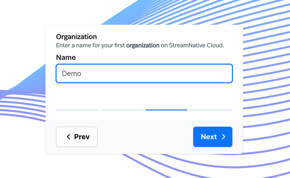
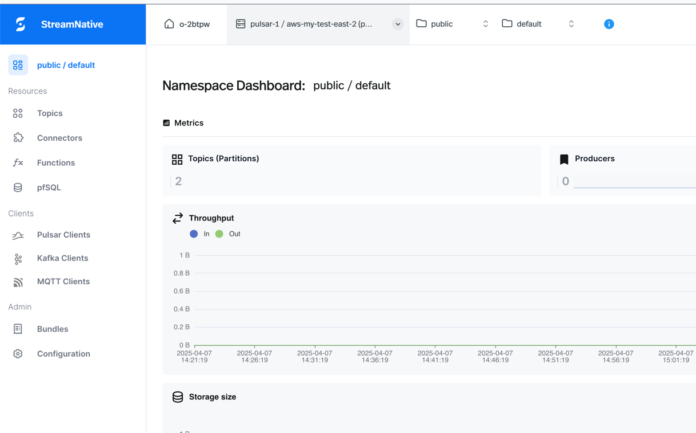
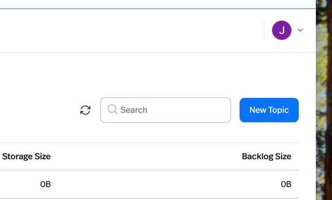
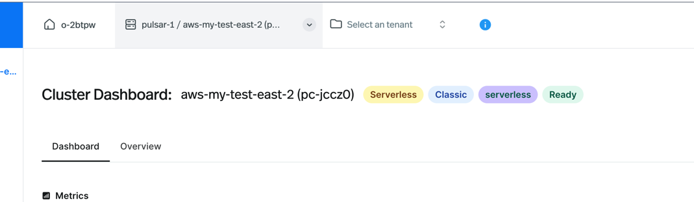
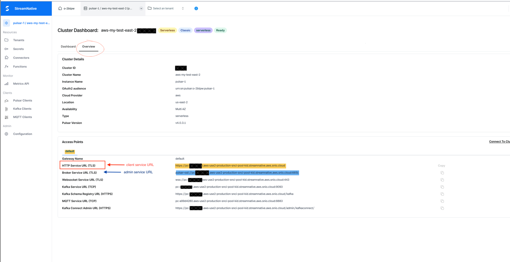

# Pulsar on StreamNative

[StreamNative Cloud](https://docs.streamnative.io/docs/cloud-overview) is a fully managed Pulsar service available on AWS, GCP, and Azure. This guide walks through connecting a StreamNative cluster to Numaflow.

## Prerequisites

- [Numaflow installed](https://numaflow.numaproj.io/quick-start/) on your Kubernetes cluster

## 1. Create a StreamNative Cluster

1. Go to [streamnative.io](https://streamnative.io/) and create an account at the [StreamNative Console](http://console.streamnative.cloud/)
2. Follow the guided prompts to create an organization

    

3. Follow steps 2–4 in the [StreamNative Quickstart Console](https://docs.streamnative.io/docs/quickstart-console)

    !!! warning
        **Save your API key in step 3.** You'll need it for the Kubernetes Secret later.

## 2. Create a Topic

Select an instance, tenant, and namespace in the top-left bar. This will allow you to select "Topics" from the 
left side of the page:



Click "New Topic" and add a name and desired number of partitions. Remember your topic name — you'll need it for the ConfigMap later.



## 3. Get the Service URL

Select your Pulsar instance from the left sidebar, then click the "Overview" tab.



!!! tip "Copy the HTTP service URL"
    Copy the **HTTP service URL** (highlighted in red below). You'll need this for both the `clientConfig.serviceUrl` and `adminConfig.serviceUrl` in your ConfigMap.



## 4. Create the ConfigMap

Update the `serviceUrl` and `topicName` fields with values from steps 2 and 3. The topic name format is `persistent://tenant/namespace/topic`. See the [Sink (Producer)](../sink/byte-array/byte-arr-sink.md) or [Source (Consumer)](../source/byte-array/byte-arr-source.md) guides for the full ConfigMap spec.

```bash
kubectl apply -f <path-to-config-map.yaml>
```

## 5. Create the Secret

Create a Kubernetes Secret with the API key you saved in step 1:

```yaml
apiVersion: v1
kind: Secret
metadata:
  name: pulsar-producer-auth-secret
type: Opaque
stringData:
  PULSAR_AUTH_TOKEN: "YOUR-API-KEY-HERE"
```

```bash
kubectl apply -f <path-to-secret.yaml>
```

!!! note "Other authentication methods"
    This implementation supports API tokens, OAuth2, Basic Auth, and more via the Secret/ConfigMap pattern. Add your credentials to the Secret as environment variables, reference them in the ConfigMap using `${ENV_VAR_NAME}` syntax, and apply both. No code changes required.

    For production, consider [External Secrets Operator](https://external-secrets.io/) with AWS Secrets Manager, Google Secret Manager, Azure Key Vault, or HashiCorp Vault.

## 6. Deploy the Producer Pipeline

This deploys a pipeline that generates one message every 10 seconds and publishes to your topic:

```bash
kubectl apply -f <path-to-producer-pipeline.yaml>
```

You should see throughput and storage changes in the StreamNative dashboard.

## 7. Deploy the Consumer Pipeline

To consume those messages, deploy a consumer pipeline using the [Source (Consumer)](../source/byte-array/byte-arr-source.md) guide. Use the same topic name and API key. Check the pod logs to see the messages produced by the first pipeline.

## Schema Validation (Optional)

If you have an Avro schema registered on your topic, you can enable schema validation. See the [Pulsar schema docs](https://pulsar.apache.org/docs/4.0.x/schema-overview/) for background.

**Producer ConfigMap:**

```yaml
producer:
  enabled: true
  useAutoProduceSchema: true    # validate payloads against the topic's schema
  dropInvalidMessages: false     # true = silently drop invalid messages; false = fail and retry
  producerConfig:
    topicName: "persistent://public/default/test-topic"
```

- `dropInvalidMessages: true` — invalid messages are dropped, pipeline continues
- `dropInvalidMessages: false` — invalid messages are reported as failures and may be retried

**Consumer ConfigMap:**

```yaml
consumer:
  enabled: true
  useAutoConsumeSchema: true     # deserialize using the topic's registered Avro schema
  consumerConfig:
    topicNames: "persistent://public/default/test-topic"
```

If a message is invalid (schema mismatch or corrupt payload), the consumer throws a `RuntimeException` and the message is not acknowledged, so it may be redelivered.
