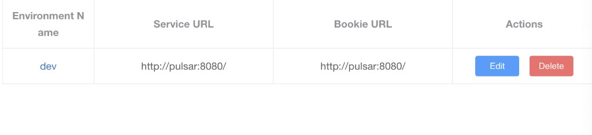

# Apache Pulsar Java

Apache Pulsar user-defined source and sink for [Numaflow](https://numaflow.numaproj.io/), implemented in Java.

This project provides a single container image that can run as either:

- A **Numaflow user-defined source** (consumer) — reads messages from a Pulsar topic and feeds them into a Numaflow pipeline
- A **Numaflow user-defined sink** (producer) — takes messages from a Numaflow pipeline and publishes them to a Pulsar topic

The mode is determined by your `application.yml` configuration (`pulsar.consumer.enabled` or `pulsar.producer.enabled`).

## Prerequisites

- A Kubernetes cluster with [Numaflow installed](https://numaflow.numaproj.io/quick-start/)
- A Pulsar cluster (local via Docker Compose, or managed via [StreamNative](get-started/pulsar-on-streamnative.md))
- Java 23 (for building from source)

## Set Up a Pulsar Cluster

You need a running Pulsar cluster before deploying the source or sink.

=== "Local (Docker Compose)"

    From the repo root (`apache-pulsar-java/`), run:

    ```bash
    docker-compose up
    ```

    This starts a Pulsar broker and the Pulsar Manager UI using the `docker-compose.yml` in the repo root.

    Then set up the Pulsar Manager admin account:

    ```bash
    CSRF_TOKEN=$(curl http://localhost:7750/pulsar-manager/csrf-token)
    curl \
      -H "X-XSRF-TOKEN: $CSRF_TOKEN" \
      -H "Cookie: XSRF-TOKEN=$CSRF_TOKEN;" \
      -H "Content-Type: application/json" \
      -X PUT http://localhost:7750/pulsar-manager/users/superuser \
      -d '{"name": "admin", "password": "apachepulsar", "description": "test", "email": "username@test.org"}'
    ```

    Access Pulsar Manager at [http://localhost:9527](http://localhost:9527) and create an environment with service URL `http://pulsar:8080/`.

    

=== "StreamNative Cloud"

    For managed Pulsar clusters on StreamNative Cloud, follow the full setup guide, which covers creating a cluster, getting your service URL, API key authentication, and wiring up ConfigMaps and Secrets for both producer and consumer.

    **[Pulsar on StreamNative →](get-started/pulsar-on-streamnative.md)**

## Get the Container Image

**Pre-built images** are published to Quay.io on every release:

```
quay.io/numaio/numaflow-java/pulsar-java:<version>
```

For example:

```bash
docker pull quay.io/numaio/numaflow-java/pulsar-java:v0.3.0
```

Browse all available tags on [Quay.io](https://quay.io/repository/numaio/numaflow-java/pulsar-java?tab=tags).

**Or build from source:**

```bash
mvn clean package
```

This builds a local Docker image tagged `apache-pulsar-java:v<version>`. Use `-Djib.to.image=apache-pulsar-java:<custom-tag>` for a custom tag.

## Create Configuration and Deploy

Before deploying, you need to create three Kubernetes resources:

1. **ConfigMap** — contains `application.yml` with your Pulsar client, consumer/producer, and admin settings
2. **Secret** — contains your Pulsar authentication credentials (e.g. API key)
3. **Pipeline** (or **MonoVertex**) — the Numaflow spec that references the ConfigMap, Secret, and container image

See the [Source (Consumer)](source/byte-array/byte-arr-source.md) or [Sink (Producer)](sink/byte-array/byte-arr-sink.md) guides for full examples of all three.

Once you have them, apply in order:

```bash
kubectl apply -f <secret.yaml>
kubectl apply -f <config-map.yaml>
kubectl apply -f <pipeline.yaml>

# (Optional) Port-forward to access Numaflow UI
kubectl -n numaflow-system port-forward deployment/numaflow-server 8443:8443
```

Optionally, access the Numaflow UI at [https://localhost:8443/](https://localhost:8443/) to monitor your pipeline.
